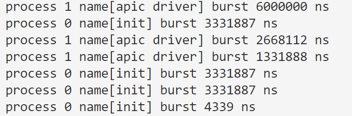

# 完全公平调度算法

## 调度策略与算法原理

### 知名应用

​	CFS（Completely Fair Scheduler，完全公平调度器）是一种进程调度策略，最早引入于Linux内核2.6.23版本。CFS的目标是在多核系统中提供公平的CPU时间分配，并以纳秒级的精度进行调度。

​	CFS调度策略通过动态地调整进程的虚拟运行时间，使得每个进程能够公平地获得CPU时间，从而提供更好的公平性和响应性。它适用于多核系统和服务器环境，能够高效地管理并调度各种类型的任务，确保系统资源的公平分配。


### 具体原理

​		CFS算法实现起来并不困难，难点在于理解其算法的数学原理为什么会成就CFS的高效性、公平性。

#### 关键概念

- **nice权重表格**


- **调度周期**

​		在某个时间长度可以保证运行队列中的每个进程至少运行一次，我们把这个时间长度称为调度周期。也称为调度延迟，因为一个进程等待被调度的延迟时间是一个调度周期 `sched_lantency`。


- **最小粒度**

​		确保进程运行一段时间后才会被抢占。如果进程的时间片长度大于最小粒度，那么当进程的实际运行时间等于或大于最小粒度的时候，刚唤醒的进程才可以抢占它，不需要等它用完一个完整的时间片。如果进程的时间片长度小于最小粒度，那么进程用完时间片以后就可以被抢占，不保证进程的实际运行时间等于或大于最小粒度。

​		在示例代码中，调度周期的默认值是6毫秒，最小粒度的默认值是0.75毫秒，一般来说，服务器的任务多为计算密集型任务，其最小粒度和调度周期都会相对我们的示例大一些。


**补充：** 如何理解上面两个概念？

​		CFS要求在一个调度周期内每一个进程都能被执行至少一次。如果假设第$i$号进程每一次被调度都能获得运行时间的长度为$time\_slice[i]$， 那么有 $\sum time\_slice[i] \equiv sched\_latency $（代码实现中因为浮点数问题不一定恒等）。 对于优先级高的进程(即nice比较小)，它获得的CPU时间长，反之则获得的CPU时间短。

​		那么可以这样子分配：

​			`time_slice[i] = （time_latency × 进程的权重 / 运行队列中所有进程的权重总和）`

​		这样计算的话，$优先级高 \rightarrow 权重大 \rightarrow 获得的cpu时间多$。		

​		上面的 `time_slice[i]` 仍然是真实的时间，是实实在在分配给进程的时间，但是我们后面要引出一个虚拟运行时间。


- **虚拟运行时间 vruntime**

​		如果把cpu运行时间也看作一种资源，为了保证资源得到公平分配，运行时间少的进程将得到更多的资源以弥补它们在过去获得的资源的不足。所以CFS定义了一个 “虚拟运行时间” 来定义一个进程获得资源的多与少，每一次调度都选择 vruntime 最小的进程，把CPU资源分配给他。

​		计算公式为：$vruntime = real\_runtime * \frac{优先级为0的进程的权重}{进程权重}$  ， 其中权重由优先级决定，可看代码中的`sched_nice_to_weight` 数组，优先级为`0`的进程权重为`1024`，每个优先级之间权重比值大概为 `1.25`。 

​		根据计算公式，每一次执行完成，都需要更新：

​		`vruntime[i] += time_slice[i] * (优先级为0的进程的权重 / 进程权重)`


**补充1：** 如何理解vruntime？

​		虚拟运行时间（vruntime）是CFS调度器中的一个重要概念，它衡量了进程在CPU上运行的相对时间，与进程的实际运行时间和权重有关。


**补充2：**为什么不直接把运行时间累加到 vruntime 呢？

​		这样做可能会导致进程之间的不公平。因为不同优先级（权重）的进程应该获得不同比例的CPU时间，如果直接累加运行时间，那么就忽略了权重的影响，可能会导致高优先级（权重）的进程被低优先级（权重）的进程抢占CPU资源。


#### 算法流程

​	上面描述的各个关键概念的方式零零散散，大部分同学们看完之后可能还是有很多问号，在这里，我们把上面的关键概念串连起来。

伪代码如下：

```ABAP
调度开始：
	1. 从等待队列中选择vruntime最小的进程，赋值给pick
	2. time_slice[pick] = （time_latency × 进程的权重 / 运行队列中所有进程的权重总和）
	3. pick.burst_time -= time_slice
	4. pick.vruntime += time_slice * (prio_0_weight / pick_weight)
结束一次调度
```


### 如何公平

​	那为什么该算法称为完全公平调度算法？相信经过了上面的分析，你可能满头雾水，也可能恍然大悟，接下来我们通过对比分析讨论到底公平在哪里。

- Round Robin的时间片轮转为手段、方法公平，虽然每个进程都能轮转，但是有的进程可能一开始就已经得到较多的资源了，这并不代表结果一定公平。
- CFS考虑了优先级、进程在过去已经获得的资源，所以更能兼顾最终结果的公平。

以图说话：左图则为Round Robin算法的结果，右图则为CFS的结果，体现了equality和equity的区别。


## 实验步骤			

​	以下实验编写的属于单进程运行的程序，难以展现出操作系统内核中真实情况下并行计算的场景。不过作者希望通过模拟该算法的实现，学生能够体会到CFS进程调度的算法步骤以及特点。

（1）我们设计一个系统内通用的进程控制块，保存进程的所有数据，包括但不限于以下内容：

```cpp
struct Process {
	int pid;          // 进程ID
	string name;      // 进程名称
	int priority;     // 进程优先级

	// 以下时间都以 ns 为单位
	int arrive_time;  // 进程到达时间
	int burst_time;   // 进程的总共需要执行时间(为了模拟进程运行而做出的假设)
	int vruntime;     // 虚拟执行时间
};
```


（2）我们不仅仅需要模拟CFS调度算法，还需要模拟在调度过程中操作系统为CFS调度器提供了什么样的帮助，比如在下面的实现中，就使用了CPU时间（无需复制该代码，该代码在第3点的scheduleCFS函数中）：

```cpp
/* 操作系统的变量 */
int current_cpu_time = 0;  // 假设目前系统刚刚启动，时间为0
```


（3）调度算法的实现：

​	为了更加简单明了，每一次寻找最小值只是简单地`for`循环寻找目标进程，效率为`O(n)`。如果学生有兴趣提高代码的性能，可以使用堆heap、红黑树等方法优化——这也是应该的。

```cpp
// 优先级权重表（nice越高分配到的cpu时间越少）
const int NICE_OFFSET = 20;
const int sched_nice_to_weight[40] = {
 /* -20 */     88761,     71755,     56483,     46273,     36291,
 /* -15 */     29154,     23254,     18705,     14949,     11916,
 /* -10 */      9548,      7620,      6100,      4904,      3906,
 /*  -5 */      3121,      2501,      1991,      1586,      1277,
 /*   0 */      1024,       820,       655,       526,       423,
 /*   5 */       335,       272,       215,       172,       137,
 /*  10 */       110,        87,        70,        56,        45,
 /*  15 */        36,        29,        23,        18,        15,
};

// 每一次调用函数都相当于系统重新运行
// 然后根据 proc[] 进程的到达时间和运行时间进行模拟
void schedule(Process proc[], int n) {
	/* 操作系统的变量 */
	int current_cpu_time             = 0;  // 假设目前系统刚刚启动，时间为0

  	/* CFS算法的变量 */
	const int PRIO_0_WEIGHT          = 1024;  // 优先级为0的进程的权重  
  	int min_vruntime                 = 0;  // CFS算法需要维护的最小虚拟执行时间 
	int sysctl_sched_min_granularity = 750'000ULL;  // 最小调度粒度(单位: ns)
	int sysctl_sched_latency         = 6'000'000ULL;  // 调度周期(具体定义在'原理'处)
	int total_weight = 0;  // 所有进程权重之和
	int pick;          // 被选进程

	/* 模拟需要，如果某一个时间点没有进程到达，那么就直接跳过一段时间 */
	int min_notarrive_time;

	// 为了实现简单，这里不使用红黑树模拟，每次从数组寻找最小值
	while (true) {

		// 计算权重之和 (简单默认进程创建之后优先级不再改变，虽然不太现实)
		total_weight = 0;
		min_notarrive_time = INT_MAX;
		for (int i = 0; i < n; i++) { 
			if (current_cpu_time >= proc[i].arrive_time) { // 已到达才有效
				total_weight += sched_nice_to_weight[proc[i].priority];
			} else {  // 未到达的做一个统计
				min_notarrive_time = min(min_notarrive_time, proc[i].arrive_time);
			}
		}

		if (total_weight == 0) {
			current_cpu_time = min_notarrive_time;
			continue;
		}


		// 选择下一次运行的程序
		pick = -1; 
		for (int i = 0; i < n; i++) {
			if (proc[i].burst_time == 0 || current_cpu_time < proc[i].arrive_time) 
				continue;  // 过滤掉已经运行完、还未到达的进程
			if (pick == -1 || proc[pick].vruntime > proc[i].vruntime)
				pick = i;
		}

		if (pick == -1)
			break; // 调度完成

		// 假设我们实现的算法是非抢占的
		// 即时间片一旦分配出去，除非进程自己放弃
		// 否则其他进程无法抢断（这里不包括也不考虑中断）
		int pick_weight = sched_nice_to_weight[proc[pick].priority];
		int calc_time = (int)sysctl_sched_latency * (1.0 * pick_weight / total_weight);
		int time_slice = min(proc[pick].burst_time, calc_time);

		// 运行 ....... 
		cout << "process " << proc[pick].pid << " name[" << proc[pick].name << "] burst " << time_slice << " ns" << endl; 

		// 更新参数
		proc[pick].burst_time -= time_slice;
		// vruntime 的更新是CFS的精髓
		proc[pick].vruntime += (int)time_slice * (1.0 * PRIO_0_WEIGHT / pick_weight);
		
		// 为刚刚到来的进程更新 vruntime，避免因为vruntime过小而一致调度它
		// 先求出min_vruntime
		min_vruntime = INT_MAX;
		for (int i = 0; i < n; i++) {
			if (proc[i].burst_time > 0 && proc[i].arrive_time <= current_cpu_time) {
				min_vruntime = min(min_vruntime, proc[i].vruntime);
			}
		}
		if (min_vruntime == INT_MAX) min_vruntime = 0;
		// 再更新
		for (int i = 0; i < n; i++) {
			if (proc[i].arrive_time > current_cpu_time 
				&& proc[i].arrive_time <= current_cpu_time + time_slice) {
				proc[i].vruntime = min_vruntime;
			}
		}
		// 更新系统时间
		current_cpu_time += time_slice;
	}
}
```


（4）写下main程序：

```cpp
int main() {
	Process proc[] = {
		{
			0,
			"init",
			NICE_OFFSET + 0,  
			500'0000,
			10'000'000,
			0, // 必须默认为 0
		},
		{
			1,
			"apic driver",
			NICE_OFFSET + 1,
			0,
			10'000'000,
			0, // 必须默认为 0
		}
	};

	schedule(proc, 2);
}
```


## 实验结果




## 参考资料

[1] [CFS Scheduler — The Linux Kernel documentation](https://docs.kernel.org/scheduler/sched-design-CFS.html)

[2] [深入详解完全公平调度算法](https://zhuanlan.zhihu.com/p/486037199)


