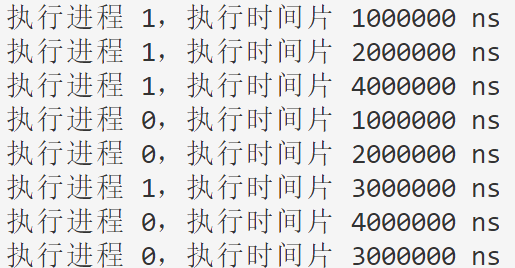

# 多级反馈队列调度算法


## 调度策略与算法原理 

​	多级反馈队列( MLFQ) 调度算法结合了先 来先服务( FCFS) 、轮转调度法( ＲＲ) 、优先级算法和 短作业优先( SJF) 算法的思想。	

​	该算法有多个队列，同一 个队列中的进程优先级相同，不同队列中的进程优 先级不同; 最高优先级上的进程运行一个时间片，次 高级上的进程运行两个时间片，再下一级运行四个 时间片，以此类推; 每当一个进程在一个优先级队列 中用完它的时间片后，就下移一级，进入另一个队 列; 在低优先级队列中等待时间过长的进程，将被移 入高优先级队列; 调度程序将该进程从等待队列中 释放后提高其优先级。

​	

​	MLFQ的设计可以根据具体需求进行调整和改进，例如，可以调整队列数量、时间片长度、优先级提升规则等来适应不同的系统环境和应用场景。该调度策略在实践中常用于操作系统中，以平衡系统的吞吐量和响应时间，同时为不同类型的进程提供适当的执行机会。


## 合理性分析

​	多级反馈队列调度算法具有良好的性能，能满足各种类型用户的需要。 

- 对终端型作业用户，由于其所提交的作业大多 属于交互作业，作业通常较小，系统只要能使这些作 业( 进程) 在第一队列所规定的时间片内完成，便可使终端型作业用户都感到满意。 
- 对短批处理作业用户：
  - 很短的批处理型作业，开始时像终端型作业一样; 如果仅在第一队列中执行 一个时间片即可完成，便可获得与终端型作业一样的响应时间。
  - 稍长的作业，通常也只需要在第二队 列和第三队列各执行一个时间片即可完成，其周转时间仍然较短。 
- 对长批处理作业用户，长作业将依次在第 $1，2， …，n $队列中运行，然后再按轮转方式运行，用户不必担心其作业长期得不到处理。 多级反馈队列调度算法需要考虑队列的个数和每个队列的时间片的选取。


## 实验步骤

​	以下实验编写的属于单进程运行的程序，难以展现出操作系统内核中真实情况下并行计算的场景。不过作者希望通过模拟该算法的实现，学生能够体会到MLFQ进程调度的算法步骤以及特点。

（1）我们设计一个系统内通用的进程控制块，保存进程的所有数据，包括但不限于以下内容：

```cpp
struct Process {
	int pid;          // 进程ID
	string name;      // 进程名称

	// 以下时间都以 ns 为单位
	int arrive_time;  // 进程到达时间
	int burst_time;   // 进程的总共需要执行时间(为了模拟进程运行而做出的假设)
};
```


（2）我们不仅仅需要模拟RR调度算法，还需要模拟在调度过程中操作系统为RR调度器提供了什么样的帮助，比如在下面的实现中，就使用了CPU时间（无需复制该代码，该代码在第3点的scheduleRR函数中）：

```cpp
/* 操作系统的变量 */
int current_cpu_time = 0;  // 假设目前系统刚刚启动，时间为0
```


（3）调度算法的实现：

```cpp
// 每一次调用函数都相当于系统重新运行
// 然后根据 proc[] 进程的到达时间和运行时间进行模拟
// q_num 表明有多少级队列
// time_slice[i] 是第i级队列的时间片，在下面的程序中，0级队列的优先级最高
void schedule(Process proc[], int p_num, int time_slice[], int q_num) {
	/* 操作系统的变量 */
	int current_cpu_time             = 0;  // 假设目前系统刚刚启动，时间为0

  	/* MLFQ算法的变量 */
	vector<queue<Process>> proc_que(q_num);
	set<int> in_queue;
	
	auto QueueEmpty = [&]() -> bool { // 辅函数
		for (int i = 0; i < q_num; i++) 
			if (proc_que[i].size()) return false;
		return true;
	};

	// 如果还有进程没有进队列，或者队列非空，则继续调度
	while (in_queue.size() < p_num || !QueueEmpty()) { 

		// 把到达但是还没有进队的进程加入队列
		for (int i = 0; i < p_num; i++) {
			if (!in_queue.count(i)) {  // 未进队
				if (proc[i].arrive_time <= current_cpu_time) { // 已到达
					in_queue.insert(i);
					proc_que[0].push(proc[i]);
				}
			}
		}

		// 如果队列还是空，则需要考虑更新cpu时间
		if (QueueEmpty()) {
			int min_arrive_time = INT_MAX;
			for (int i = 0; i < p_num; i++) {
				if (!in_queue.count(i)) {  // 未进队
					min_arrive_time = min(min_arrive_time, proc[i].arrive_time);
				}
			}
			current_cpu_time = min_arrive_time;
			continue;
		}

		// 开始调度
		for (int i = 0; i < q_num; i++) { // 0号队列优先级最高
			while (proc_que[i].size()) {
				Process head = proc_que[i].front();
				proc_que[i].pop();
				int burst_time = min(time_slice[i], head.burst_time);
				head.burst_time -= burst_time;
				current_cpu_time += burst_time;

				cout << "执行进程 " << head.pid << "，执行时间片 " << burst_time << " ns" << endl;

				// 再次加入队列
				if (head.burst_time > 0) {
					int next_que_id = (i == q_num - 1) ? q_num - 1 : i + 1;
					proc_que[next_que_id].push(head);
				}

				// 调度一个进程之后，立刻break，以防更高级的队列有新的进程进来
				// 除非当前进程是最高级的
				if (i > 0) goto next_sched;
			}
		}

		// 这一次调度结束, 下一次调度开始
		next_sched: ;
	}
}
```


（4）写下main程序：

```cpp
int main() {
	Process proc[] = {
		{
			0,
			"init",
			500'0000,
			10'000'000,
		},
		{
			1,
			"apic driver",
			0,
			10'000'000,
		}
	};

	// 一般是2倍累乘
	int time_slice[] = {1000'000, 2000'000, 4000'000};

	schedule(proc, 2, time_slice, 3);
}
```


## 实验结果




## 参考资料

 [1] [基于进程执行时间的多级反馈队列调度算法 - 中国知网 (cnki.net)](https://kns.cnki.net/kcms2/article/abstract?v=3uoqIhG8C44YLTlOAiTRKibYlV5Vjs7ir5D84hng_y4D11vwp0rrtVMX1j4_xGhoOYPAYVS49sX7zImBj4QPb3A6ELSuQbmR&uniplatform=NZKPT)

