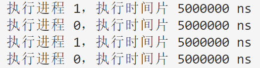

# 完全公平调度算法

## 调度策略与算法原理

​	RR（Round-Robin，轮转调度）是一种常见的进程调度策略，它以时间片（固定时间段）为单位，依次为每个进程分配CPU时间。每个进程在就绪队列中按照到达顺序排队，并且每个进程都能够在一个时间片内获得一定的CPU执行时间，然后被放回队列尾部继续等待执行。

基本原则和策略：

1. 时间片：RR调度策略将CPU时间划分为固定的时间片。当一个进程获得CPU执行时，它被允许执行一个时间片的长度，然后被放回队列等待下一次执行。
2. 队列调度：进程按照到达顺序排队在就绪队列中，每个进程依次获得执行机会。当一个进程的时间片用完后，==它被放回队列的尾部==，下一个进程开始执行。
3. 循环执行：RR调度策略按照循环的方式执行进程，每个进程都能获得一定的CPU时间，以确保公平性。
4. 非抢占式调度：一个进程在执行过程中不会被强制中断或抢占，直到它的时间片用完。

​	RR调度策略具有公平性和响应性，因为每个进程都能获得一定的执行时间，并且长时间运行的进程不会占用所有的CPU时间。然而，如果时间片过小，会导致频繁的上下文切换，增加系统开销；如果时间片过大，会影响系统对紧急任务的响应时间。

​	RR调度策略在操作系统中被广泛应用，尤其是在分时系统和交互式系统中，它能够合理分配CPU时间，提供良好的用户体验。


## 实验步骤			

​	以下实验编写的属于单进程运行的程序，难以展现出操作系统内核中真实情况下并行计算的场景。不过作者希望通过模拟该算法的实现，学生能够体会到RR进程调度的算法步骤以及特点。

（1）我们设计一个系统内通用的进程控制块，保存进程的所有数据，包括但不限于以下内容：

```cpp
struct Process {
	int pid;          // 进程ID
	string name;      // 进程名称

	// 以下时间都以 ns 为单位
	int arrive_time;  // 进程到达时间
	int burst_time;   // 进程的总共需要执行时间(为了模拟进程运行而做出的假设)
};
```


（2）我们不仅仅需要模拟RR调度算法，还需要模拟在调度过程中操作系统为RR调度器提供了什么样的帮助，比如在下面的实现中，就使用了CPU时间（无需复制该代码，该代码在第3点的scheduleRR函数中）：

```cpp
/* 操作系统的变量 */
int current_cpu_time = 0;  // 假设目前系统刚刚启动，时间为0
```


（3）调度算法的实现：

```cpp
void schedule(Process proc[], int n, int time_slice) {
	sort(proc, proc + n, [](Process a, Process b) {
		return a.arrive_time < b.arrive_time;
	}); // 按到达时间排序

	int current_cpu_time = 0;  // 假设目前系统刚刚启动，时间为0
	int min_notarrive_time;

	bool notfinished;
	do {
		notfinished = false;   
		min_notarrive_time = INT_MAX;

		for (int i = 0; i < n; i++) {
			Process* curr = &proc[i];

			int burst = 0;

			if (curr->arrive_time <= current_cpu_time) {  // 进程到达
				// 执行一个时间片
				burst = min(time_slice, curr->burst_time);
				cout << "执行进程 " << curr->pid << "，执行时间片 " << burst << " ns" << endl;
				curr->burst_time -= burst;
			} else {  // 未到达
				min_notarrive_time = min(min_notarrive_time, curr->arrive_time);
			}

			if (curr->burst_time > 0) notfinished = true;
			
			if (burst) current_cpu_time += burst;
			else current_cpu_time = min_notarrive_time;
		}
	} while (notfinished);
}
```


（4）写下main程序：

```cpp
int main() {
	Process proc[] = {
		{
			0,
			"init",
			500'0000,
			10'000'000,
		},
		{
			1,
			"apic driver",
			0,
			10'000'000,
		}
	};

	schedule(proc, 2, 500'0000);
}
```


## 实验结果




